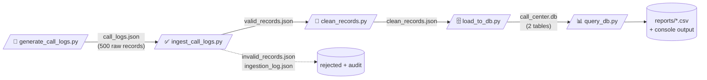

<div align="center">

# 📞 Call Centre ETL Pipeline

### Raw messy call logs → validated → cleaned → SQLite → SQL insights

*A complete, reproducible data engineering pipeline in pure Python — zero external dependencies.*


</div>

---

It simulates a real-world collections / tele-calling scenario:

> 🗂️ Raw, messy call logs come in → ✅ validated → 🧹 cleaned & enriched → 🗄️ loaded into SQLite → 📊 analyzed with SQL to answer business questions.

---

## 🗺️ Pipeline at a Glance



| # | Stage | Script | What it does |
|---|---|---|---|
| 1️⃣ | **Generate** | `generate_call_logs.py` | Creates 500 intentionally messy raw call records |
| 2️⃣ | **Ingest / Validate** | `ingest_call_logs.py` | Validates every record; splits valid vs invalid |
| 3️⃣ | **Clean / Transform** | `clean_records.py` | Dedupes, normalizes timestamps to IST, derives new columns |
| 4️⃣ | **Load** | `load_to_db.py` | Loads clean data into SQLite (idempotent) |
| 5️⃣ | **Analyze** | `query_db.py` | Answers business questions with SQL; exports CSVs |

---

## ⚡ Quick Start

**Requirements:** Python 3.7+ — that's it. No `pip install`, everything is standard library
(`json`, `random`, `copy`, `datetime`, `os`, `sqlite3`, `csv`).

```bash
python generate_call_logs.py    # 1️⃣ create raw data
python ingest_call_logs.py      # 2️⃣ validate & split
python clean_records.py         # 3️⃣ clean & enrich
python load_to_db.py            # 4️⃣ load into SQLite
python query_db.py              # 5️⃣ run SQL analysis
```

Each script prints a summary when it finishes. ⏱️ Total runtime: a few seconds.

> 💡 **Note:** All scripts anchor their file paths to the script's own folder, so they
> work correctly no matter which directory your terminal is in when you run them.

---

## 🔍 Stage Details

### 1️⃣ Generate Raw Data — `generate_call_logs.py`

Produces **`call_logs.json`** — exactly **500 records** (475 unique + 25 duplicates).

<details>
<summary><b>📋 Record schema (click to expand)</b></summary>

| Field | Type | Example |
|---|---|---|
| `call_id` | string | `"CALL_00042"` |
| `agent_id` | string | `"AGT_017"` |
| `customer_phone` | string | `"+919876543210"` |
| `start_time` | ISO timestamp | `"2026-07-01T14:23:05"` |
| `end_time` | ISO timestamp | `"2026-07-01T14:29:41"` |
| `call_outcome` | enum | `connected` / `no_answer` / `dropped` / `callback_requested` |
| `language` | enum | `Hindi` / `English` / `Marathi` |
| `disposition_code` | enum | `PTP`, `RTP`, `WN`, `NI`, `DNC`, `BUSY`, `SWITCHED_OFF` |
| `amount_promised` | number or null | `12500` |
| `retry_flag` | boolean | `true` |

</details>

**💥 Intentional data-quality problems** (to simulate real messy data):

| Problem | Rate | Example |
|---|---|---|
| 🕳️ Missing fields | ~15% | a random field set to `null` |
| 👯 Duplicates | ~5% | 25 exact copies (part of the 500, not extra) |
| 🕰️ Malformed timestamps | ~3% | `"2026-13-01T25:61:00"`, `"not_a_timestamp"`, `""` |

**🎯 Reproducibility:** a fixed random seed (`RANDOM_SEED = 42`) means every run
produces byte-for-byte identical output.

```python
TOTAL_RECORDS  = 500
DUPLICATE_RATE = 0.05
NUM_DUPLICATES = int(TOTAL_RECORDS * DUPLICATE_RATE)   # 25
UNIQUE_RECORDS = TOTAL_RECORDS - NUM_DUPLICATES        # 475
```

---

### 2️⃣ Ingest & Validate — `ingest_call_logs.py`

Reads `call_logs.json`, validates **every record**, and splits them into:

| Output file | Contents |
|---|---|
| ✅ `valid_records.json` | Records that passed every check |
| ❌ `invalid_records.json` | Failed records, each with a `validation_errors` list explaining **why** |
| 🧾 `ingestion_log.json` | Run summary: totals, valid/invalid counts, failure breakdown |

**Validation checks** — small, single-purpose functions:

| Function | Checks |
|---|---|
| `validate_missing_fields()` | All required fields present and non-empty |
| `validate_data_types()` | Correct types + categorical values in the allowed sets |
| `validate_timestamp()` | A timestamp string parses as a real ISO datetime |
| `validate_record_timestamps()` | Both timestamps valid **and** `end_time` > `start_time` |
| `is_duplicate()` | `call_id` already seen earlier in the file |
| `validate_record()` | Orchestrator — runs all checks, collects all failure reasons |

**👯 Duplicate rule:** the *first* occurrence of a `call_id` is kept as valid;
later copies are rejected with reason `duplicate call_id`.

**📈 Typical result:** 500 in → ~395 valid, ~105 invalid
(≈78 missing-field failures, ≈15 malformed timestamps, ≈19 duplicates —
some duplicates also carry other injected errors, so they're counted under
their first failure reason).

---

### 3️⃣ Clean & Transform — `clean_records.py`

Reads `valid_records.json` → produces **`clean_records.json`**, the analytics-ready dataset.

**Transformations (in order):**

1. 👯 **Deduplicate on `call_id`** — keep the **latest** record by `start_time`
   (a safety net; Task 2 already removed exact duplicates).
2. 🕰️ **Normalize timestamps to IST** (UTC+05:30) — raw naive timestamps are treated
   as UTC and converted → `2026-07-04T19:54:25+05:30`.
   Also computes **`call_duration_seconds`** = `end_time − start_time`.
3. 🧬 **Derive new columns:** `call_hour` (0–23) · `call_date` (`YYYY-MM-DD`) · `is_weekend`
4. 🪣 **Bucket duration** into `duration_bucket`:

   | Bucket | Duration |
   |---|---|
   | 🟢 `short` | under 60s |
   | 🟡 `medium` | 60–300s |
   | 🔴 `long` | over 300s |

5. 🚩 **Impute `amount_promised` nulls with `0`** and flag with **`is_amount_imputed = true`** —
   so a real ₹0 promise is never confused with a filled-in missing value.

---

### 4️⃣ Load into SQLite — `load_to_db.py`

Loads the clean data into a local database file: **`call_center.db`**.

| Table | Primary key | Contents |
|---|---|---|
| 📞 `calls` | `call_id` | One row per cleaned call (all 16 columns) |
| 🧾 `ingestion_log` | `run_timestamp` | One row per pipeline run: input file, records processed, valid count, rejected count |

**♻️ Idempotency (safe to re-run):**

- Tables created with `CREATE TABLE IF NOT EXISTS`
- Rows inserted with `INSERT OR REPLACE` keyed on the primary key —
  an existing row is **overwritten, never duplicated**
- 🧪 **Proof:** run `python load_to_db.py` twice → row counts stay identical
  (395 calls, 1 log row) instead of doubling

---

### 5️⃣ SQL Analysis — `query_db.py`

Answers 5 business questions. Each answer is **printed to the console** ✚ **saved as a CSV** in `reports/`.

| # | Question | CSV output |
|---|---|---|
| Q1 | Connect rate by language | `connect_rate_by_language.csv` |
| Q2 | Which hour has the highest `callback_requested` rate? | `callback_rate_by_hour.csv` |
| Q3 | % of calls that are `long` + their average `amount_promised` | `long_calls_stats.csv` |
| Q4 | Top 3 agents by total calls, with outcome distribution | `top3_agents_outcomes.csv`, `top3_agents_totals.csv` |
| Q5 | Call volume trend across dates | `call_volume_by_date.csv` |

**🏆 Sample findings** (from the seeded data — you'll get the exact same numbers):

> 🗣️ **Marathi** has the highest connect rate (~31.6%), then Hindi, then English.
> ⏰ **15:00 (3 PM)** has the highest callback rate — **50%**.
> 📏 **~65%** of calls are `long`; their average promised amount ≈ **₹9,123**
> *(includes imputed 0s — filter `is_amount_imputed = 0` to average only real promises)*
> 🥇 Top agents: **AGT_058** (11 calls), **AGT_085** (9), **AGT_089** (7).

**The SQL pattern powering every "rate" question** (conditional aggregation):

```sql
100.0 * SUM(CASE WHEN call_outcome = 'connected' THEN 1 ELSE 0 END) / COUNT(*)
```

---

## 📁 Project Structure

```
📦 Call-Centre-ETL-Pipeline
├── 🐍 generate_call_logs.py     # 1️⃣ raw data generator (seeded)
├── 🐍 ingest_call_logs.py       # 2️⃣ validation & splitting
├── 🐍 clean_records.py          # 3️⃣ cleaning & enrichment
├── 🐍 load_to_db.py             # 4️⃣ SQLite loader (idempotent)
├── 🐍 query_db.py               # 5️⃣ SQL analysis + CSV reports
├── 📖 README.md
│
│   ⚙️ Generated at runtime:
├── call_logs.json               # 500 raw messy records
├── valid_records.json           # records that passed validation
├── invalid_records.json         # failed records + reasons
├── ingestion_log.json           # run summary (also loaded into the DB)
├── clean_records.json           # analytics-ready dataset
├── call_center.db               # SQLite DB (tables: calls, ingestion_log)
└── reports/                     # one CSV per business question
```

---

## 🧠 Design Decisions Worth Noting

| | Decision | Why it matters |
|---|---|---|
| 🎯 | **Reproducible by design** | Fixed seed (42) → anyone running this gets identical results |
| ♻️ | **Idempotent load** | Re-run the loader any number of times — zero duplicate rows |
| 🔎 | **Every rejection is explained** | Invalid records carry `validation_errors`; data loss is never silent |
| 🚩 | **Imputation is flagged, never hidden** | `is_amount_imputed` keeps a real 0 distinct from a filled-in null |
| 📍 | **Path-safe scripts** | Paths anchored to the script's folder — terminal location doesn't matter |
| 🧩 | **Small single-purpose functions** | Each check/transform is independently testable |
| 🪶 | **Zero dependencies** | Standard library only — nothing to install, nothing to break |

---

## 🗄️ Inspecting the Database

The `.db` file isn't human-readable in a text editor. Options:

- **VS Code:** install the free *SQLite Viewer* extension → click `call_center.db`
- **Python one-liner:**

```bash
python -c "import sqlite3; conn = sqlite3.connect('call_center.db'); [print(r) for r in conn.execute('SELECT call_id, call_outcome, duration_bucket FROM calls LIMIT 5')]"
```

---

<div align="center">

**Built with 🐍 pure Python · 🗄️ SQLite · and a fixed random seed 🎲**

</div>
END
